<!--
  PALETTE — taken from akramtouabet.com (globals.css)
    ink #15161b · bleu-deep #1b2554 · bleu #26357a
    bleu-lift #93a1e6 (light tint, for text on dark) · craie #f1efe7
  Content sourced from the live site: positioning, bio, stack, projects, location.
-->

 

---

## About

Full stack developer. I build web applications end to end — from the backend architecture to the user interface.

- **AWS Certified Developer — Associate** (DVA-C02)
- Based in **Paris** · on-site, hybrid or remote
- I prototype fast, then engineer it properly

---

## Stack

**Frontend**

**Backend & data**

**AWS**

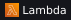
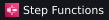
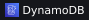
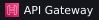
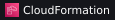
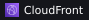
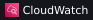
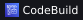
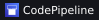
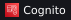
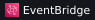
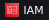
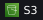
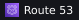
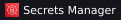
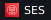
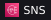
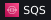

**Tooling**

---

## Projects

**[AS2 Fleurs](https://akramtouabet.com)** · e-commerce, 2026
Storefront for an independent florist, with a bouquet configurator and an admin back-office.

**[akramtouabet.com](https://akramtouabet.com)** · portfolio
Next.js 16, React 19, Tailwind 4. Meeting scheduler wired to Google Calendar.

---

## Activity

